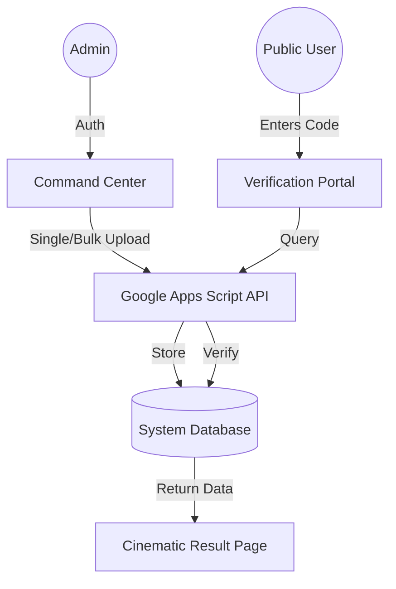

# 🛡️ Tiesverse: Global Role Verification Network

[](https://react.dev/)
[](https://vitejs.dev/)
[](https://developers.google.com/apps-script)
[](https://tiesverse.com)

Tiesverse is a high-security, blockchain-inspired role verification platform designed to build trust in professional ecosystems. It provides a standardized framework for verifying internships, webinars, and certifications through globally unique 10-digit identifiers.

## 🌟 Overview
In an era of resume fraud, **Tiesverse** provides a single source of truth for professional credentials. It allows organizations to issue tamper-proof digital records and enables public verification with zero friction.

### The Core Idea
Every credential issued via Tiesverse is assigned a **Global Verification Code**. This code acts as a direct link to the verified system record, providing instant confirmation of the recipient's role, duration, and performance without requiring manual background checks.

---

## ✨ Key Features

### 👤 Public Verification Portal
- **Instant Lookup**: Public users can verify any credential using a 10-digit unique code.
- **Cinematic Results**: High-fidelity results page showcasing professional details, roles, and dates with a premium dark-mode aesthetic.
- **Trust Indicators**: Visual status badges (Approved/Pending) for immediate clarity.

### 🛡️ Admin Command Center
- **Secure Provisioning**: Dedicated portal for authorized personnel to issue new credentials.
- **Batch Processor**: Support for bulk uploads via CSV to manage large-scale certification events.
- **PDF Generation**: Integrated automated certificate generation for verified roles.
- **Database Query Tool**: Advanced search for managing and tracking system records.

---

## 🏗 System Architecture



---

## 🛠 Tech Stack

| Layer | Technology |
| :--- | :--- |
| **Framework** | [React](https://react.dev/) (Vite) |
| **Styling** | [Tailwind CSS](https://tailwindcss.com/) |
| **API/Backend** | Google Apps Script (REST) |
| **Database** | Spreadsheets (Secure API Access) |
| **Storage** | Integrated Cloud Storage for PDFs |

---

## ⚙️ Setup & Installation

### Prerequisites
- [Node.js](https://nodejs.org/) (v16+)
- A Google Apps Script deployment URL

### 1. Clone & Install
```bash
git clone https://github.com/santanu949/tiesverse-verification.git
cd tiesverse-verification
npm install
```

### 2. Configure API
Update the `API_URL` constant in `src/App.jsx` with your deployment endpoint:
```javascript
const API_URL = "https://script.google.com/macros/s/.../exec";
```

### 3. Run Development Server
```bash
npm run dev
```

---

## 📖 Usage Guide

### For Administrators
1. **Initialize Session**: Log in via the /admin portal using secure credentials.
2. **Issue Credential**: Select a category (Internship/Webinar/Cert) and enter recipient details.
3. **Batch Upload**: Use the "Batch Processor" to upload a CSV of multiple recipients.
4. **Generate**: Trigger PDF certificate generation for any verified user.

### For Verification
1. **Input Code**: Enter the 10-digit code received on the certificate.
2. **Verify**: Review the official system record to confirm legitimacy.

---

## 📈 Current Status
- **Verification Engine**: Production Ready.
- **Admin Dashboard**: Version 2.0 (Active).
- **PDF Generation**: Automated (Active).

---

<div align="center">
  <p>© 2026 TIESVERSE. Building the infrastructure of trust.</p>
</div>
