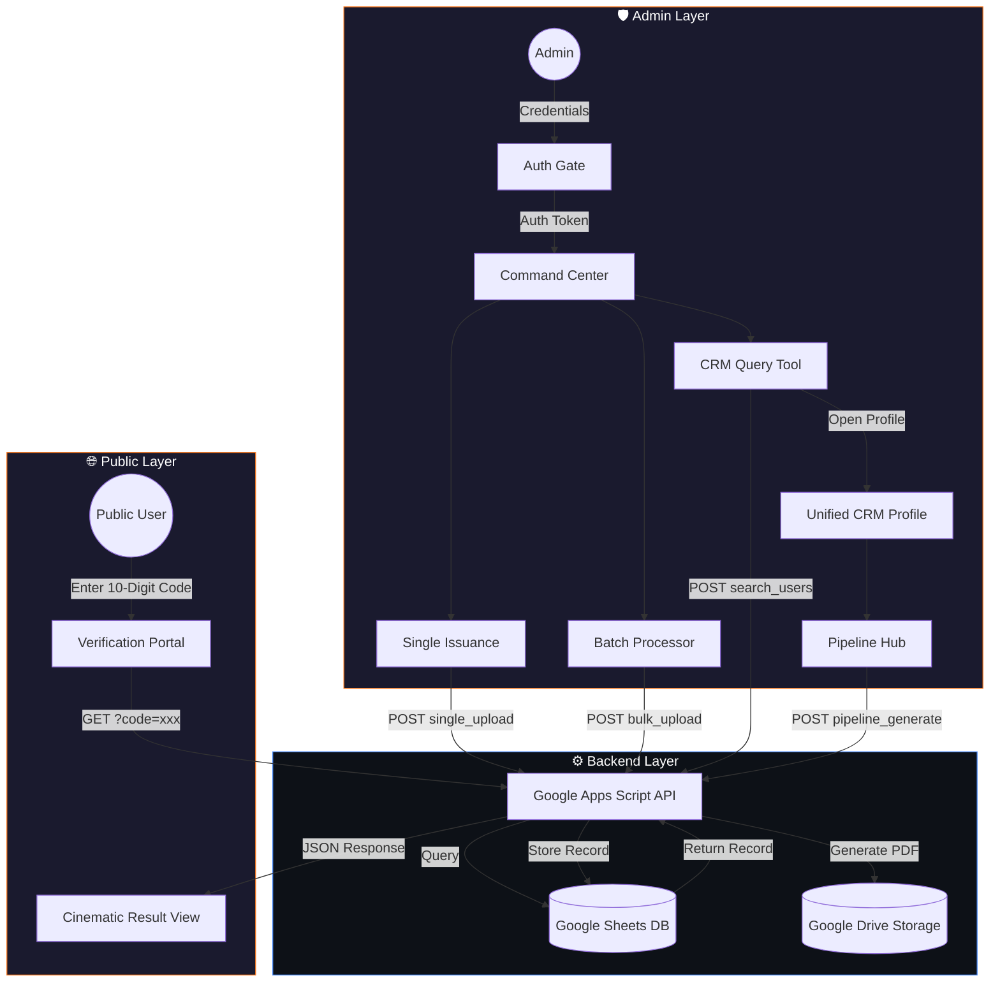

<div align="center">

# 🔐 TIESVERSE

### Global Role Verification Network

[](https://react.dev/)
[](https://vitejs.dev/)
[](https://tailwindcss.com/)
[](https://developers.google.com/apps-script)
[](https://tiesverse.com)
[]()

<br/>

**A high-security, blockchain-inspired credential verification platform that assigns globally unique 10-digit identifiers to professional records — enabling instant, tamper-proof verification of internships, certifications, webinars, and organizational roles.**

<br/>

[Live Platform](#) · [Report Issue](https://github.com/santanu949/Tiesverse-Verification-System/issues) · [Request Feature](https://github.com/santanu949/Tiesverse-Verification-System/issues)

</div>

---

## 📖 Overview

### The Problem

In professional ecosystems, resume fraud and credential misrepresentation are pervasive. Traditional background checks are slow, manual, and expensive — leaving organizations vulnerable to unverified claims about internships, certifications, and job roles.

### The Solution

**Tiesverse** provides a **single source of truth** for professional credentials. Every credential issued through the platform is assigned a **Global Verification Code** — a unique 10-digit identifier that acts as a cryptographic fingerprint for the record. Anyone with this code can instantly verify the authenticity of a credential without manual intervention, third-party services, or institutional dependencies.

The system operates on two planes:
- **Public Verification Portal** — Zero-friction instant lookup for anyone holding a verification code.
- **Admin Command Center** — Secure, role-gated dashboard for authorized personnel to issue, manage, and track credentials at scale.

---

## ✨ Key Features

### 🌐 Public Verification Portal

| Feature | Description |
| :--- | :--- |
| **Instant Code Lookup** | Verify any credential using a 10-digit unique code — results in under 2 seconds |
| **Cinematic Result View** | Premium dark-mode UI with verified identity display, role details, and duration |
| **Trust Indicators** | Visual status badges (Active/Pending) with color-coded accent bars for instant clarity |
| **System Validation Panel** | Displays the Global Query Code with cryptographic verification confirmation |

### 🛡️ Admin Command Center

| Feature | Description |
| :--- | :--- |
| **Multi-Category Issuance** | Issue credentials across 4 categories: Offer Letter, Internship, Webinar, Member Certificate |
| **Single Issuance** | Granular form with gender routing, role selection, date pickers, and lead assignment |
| **Batch Processor** | Bulk CSV upload with interactive review table — assign gender, template per row before execution |
| **Pipeline Hub** | Sequential document generation engine: Offer Letter → Internship → Member Certificate |
| **CRM Database Query** | Full-text search across all records by name, role, or code — with one-click profile access |
| **Unified CRM Dashboard** | Deep profile view with inline editing, record updates, and pipeline document regeneration |
| **PDF Generation** | Automated certificate/document generation with template selection (TechTies / TiesVerse) |

---

## 🏗️ System Architecture


```mermaid
graph TD
    subgraph Public["🌐 Public Layer"]
        User((Public User))
        Portal[Verification Portal]
        Result[Cinematic Result View]
    end

    subgraph Admin["🛡️ Admin Layer"]
        AdminUser((Admin))
        Login[Auth Gate]
        CMD[Command Center]
        Single[Single Issuance]
        Batch[Batch Processor]
        CRM[CRM Query Tool]
        Profile[Unified CRM Profile]
        Pipeline[Pipeline Hub]
    end

    subgraph Backend["⚙️ Backend Layer"]
        GAS[Google Apps Script API]
        Sheets[(Google Sheets DB)]
        Drive[(Google Drive Storage)]
    end

    User -->|Enter 10-Digit Code| Portal
    Portal -->|GET ?code=xxx| GAS
    GAS -->|Query| Sheets
    Sheets -->|Return Record| GAS
    GAS -->|JSON Response| Result

    AdminUser -->|Credentials| Login
    Login -->|Auth Token| CMD
    CMD --> Single & Batch & CRM
    Single -->|POST single_upload| GAS
    Batch -->|POST bulk_upload| GAS
    CRM -->|POST search_users| GAS
    CRM -->|Open Profile| Profile
    Profile --> Pipeline
    Pipeline -->|POST pipeline_generate| GAS
    GAS -->|Generate PDF| Drive
    GAS -->|Store Record| Sheets

    style Public fill:#1a1a2e,stroke:#f97316,color:#fff
    style Admin fill:#1a1a2e,stroke:#f97316,color:#fff
    style Backend fill:#0d1117,stroke:#4285F4,color:#fff
```

### Data Flow

1. **Credential Issuance** → Admin submits record via Single/Batch → Apps Script validates & stores in Google Sheets → Unique 10-digit code generated & returned.
2. **Document Generation** → Admin triggers pipeline stage → Apps Script creates PDF from template → Stored in Google Drive → Link persisted in database.
3. **Public Verification** → User enters code → GET request to Apps Script → Record fetched from Sheets → Rendered in cinematic result view.

---

## 🛠️ Tech Stack

| Layer | Technology | Purpose |
| :--- | :--- | :--- |
| **Frontend Framework** | [React 19](https://react.dev/) | Component-based UI with hooks-driven state |
| **Build Tool** | [Vite 8](https://vitejs.dev/) | Lightning-fast HMR and optimized production builds |
| **Styling** | [Tailwind CSS 3.4](https://tailwindcss.com/) | Utility-first CSS with custom dark-mode design system |
| **Date Handling** | [react-datepicker](https://reactdatepicker.com/) + [date-fns](https://date-fns.org/) | Locale-aware date input with timezone-safe formatting |
| **API / Backend** | [Google Apps Script](https://developers.google.com/apps-script) | Serverless REST API with built-in auth |
| **Database** | Google Sheets (via Apps Script) | Structured record storage with API-level access control |
| **File Storage** | Google Drive | Automated PDF certificate storage and retrieval |
| **Linting** | [ESLint 9](https://eslint.org/) | Code quality enforcement with React hooks rules |

---

## ⚙️ Setup & Installation

### Prerequisites

- **[Node.js](https://nodejs.org/)** v18+ (LTS recommended)
- **npm** v9+ (ships with Node.js)
- A deployed **Google Apps Script** web app URL (for backend API)

### 1. Clone the Repository

```bash
git clone https://github.com/santanu949/Tiesverse-Verification-System.git
cd Tiesverse-Verification-System
```

### 2. Install Dependencies

```bash
npm install
```

### 3. Configure the API Endpoint

Open `src/constants/index.js` and update the `API_URL` with your Google Apps Script deployment URL:

```javascript
export const API_URL = "https://script.google.com/macros/s/YOUR_DEPLOYMENT_ID/exec";
```

### 4. Start the Development Server

```bash
npm run dev
```

The app will be available at `http://localhost:5173` (default Vite port).

### 5. Build for Production

```bash
npm run build
npm run preview   # Preview the production build locally
```

---

## 📖 Usage Guide

### For Public Users (Verification)

1. Navigate to the landing page.
2. Enter the **10-digit verification code** found on the certificate or document.
3. Click **Verify** — the system will return the authenticated record with name, role, duration, and validation status.

### For Administrators

1. **Login** — Click "Admin Login" in the navbar → enter secure credentials.
2. **Select Category** — Choose from Offer Letter, Internship, Webinar, or Member Certificate.
3. **Single Issuance** — Fill in the form (name, role, dates, gender, lead) → click "Authorize & Generate" → receive a unique verification code.
4. **Batch Upload** — Switch to "Batch Processor" → upload a CSV → review/edit rows in the interactive table → execute template routing.
5. **CRM Search** — Use the Database Query Tool to search by name, role, or code → open any result's full CRM profile.
6. **Pipeline Generation** — From a CRM profile, generate sequential documents (Offer Letter → Internship Certificate → Member Certificate) with one click.

### CSV Format for Batch Upload

```
Ignore, Name, Role, StartDate, EndDate, Lead
, John Doe, Tech and Content Team, 2026-01-15, 2026-04-15, Jane Smith
, Alice Brown, Graphics Team, 2026-02-01, 2026-05-01, Bob Wilson
```

---

## 📁 Project Structure

```
Tiesverse-Verification-System/
├── public/                          # Static assets
├── src/
│   ├── api/
│   │   └── verificationApi.js       # All backend API calls (login, upload, search, pipeline)
│   ├── components/
│   │   ├── ui/
│   │   │   ├── DatePickerStyles.jsx  # Global date picker theme overrides
│   │   │   └── StrictDateInput.jsx   # Custom date input with strict DD/MM/YYYY formatting
│   │   ├── AdminDashboard.jsx        # Full command center with tabs, forms, and CRM
│   │   ├── AdminLogin.jsx            # Secure login portal
│   │   ├── BatchDashboard.jsx        # CSV review table with per-row controls
│   │   ├── CRMDashboard.jsx          # Unified profile with edit + pipeline generation
│   │   ├── CRMSearchTool.jsx         # Database query interface
│   │   ├── HeroSection.jsx           # Landing page hero with search
│   │   ├── Navbar.jsx                # Top navigation with view switching
│   │   ├── UnifiedForm.jsx           # Dynamic form for all credential categories
│   │   └── VerificationResult.jsx    # Public read-only verification display
│   ├── constants/
│   │   └── index.js                  # API URL, role lists, categories, shared styles
│   ├── utils/
│   │   └── dateUtils.js              # Timezone-safe date formatting utilities
│   ├── App.jsx                       # Root orchestrator (state + routing)
│   ├── App.css                       # Base application styles
│   ├── index.css                     # Tailwind directives + custom animations
│   └── main.jsx                      # React DOM entry point
├── index.html                        # HTML shell
├── vite.config.js                    # Vite configuration
├── tailwind.config.js                # Tailwind CSS configuration
├── postcss.config.js                 # PostCSS pipeline
├── eslint.config.js                  # ESLint rules
├── package.json                      # Dependencies and scripts
└── README.md                         # This file
```

---

## 📈 Current Status

| Module | Status | Version |
| :--- | :--- | :--- |
| Public Verification Engine | 🟢 Production | v2.0 |
| Admin Command Center | 🟢 Production | v2.0 |
| Batch Processor | 🟢 Production | v2.0 |
| Pipeline Document Generation | 🟢 Production | v2.0 |
| CRM Dashboard + Search | 🟢 Production | v2.0 |
| PDF Auto-Generation | 🟢 Active | v2.0 |

---

## 👥 Contributors

<table>
  <tr>
    <td align="center">
      <a href="https://github.com/santanu949">
        <br />
        <sub><b>Santanu</b></sub>
      </a><br />
      <sub>Creator & Lead Developer</sub>
    </td>
  </tr>
</table>

---

<div align="center">
  <br/>
  
  <br/><br/>
  <sub>© 2026 TIESVERSE — All Rights Reserved.</sub>
</div>
